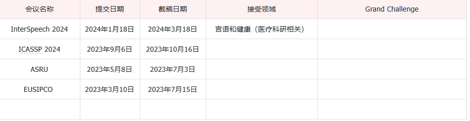
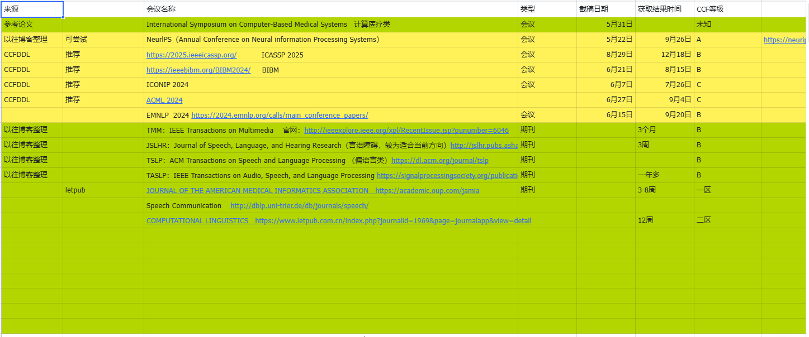

InterSpeech
- InterSpeech2024链接：https://interspeech2024.org/speech-and-beyond/
论文接受主题
具体的接受主题如下
- Speech and Health: Analyzing speech for health-related diagnostics.
  言语健康：通过分析语音来进行与健康相关的诊断
- Animal Voices Recognition: Understanding and recognizing animal voices, such as bird species, bats, and pets.
  动物声音识别：理解和识别动物的声音，例如鸟类、蝙蝠和宠物。
- Speech for Memory & Heritage: Preserving and curating historical recordings.
记忆与遗产演讲：保存和策划历史记录。
- Voice Communication Across Ages: Studying speech patterns in Babies and the Elderly.
跨年龄的语音通信：研究婴儿和老年人的语音模式。
- Human-Machine Interaction: Exploring speech in gaming, VR/AR/XR, and Robot Audition
人机交互：探索游戏、VR/AR/XR 和机器人试听中的语音
- 2023年主题：包容性口语科学与技术——打破障碍
下述为2023年的提交方向
[图片]
论文相关日期
 这里并没有找到InterSpeech2024的相关日程安排，参考一下2023年的情况分析    https://interspeech2023.org/important-dates-deadlines/
- 论文提交开始
  - 2023年1月18日
- 截止日期
  - 2023年3月18日
- 录用通知
  - 2023年5月17日

ICASSP
2024 IEEE International Conference on Acoustics, Speech and Signal Processing
论文接受主题
这里全部都摘出来，太浪费时间了，仅仅找出和我研究相关的，具体链接https://2024.ieeeicassp.org/call_for_papers/
- Deep Learning/Machine Learning for Signal Processing
用于信号处理的深度学习/机器学习
- Audio & Acoustic Signal Processing
音频和声学信号处理
- Speech and Language Processing
语音和语言处理
论文相关日期
- 论文提交
  - 2023年9月6日
- 审核截止
  - 2023年10月16日
Grand Challenge挑战
具体网址  https://2024.ieeeicassp.org/sp-grand-challenges/
- Multimodal Information Based Speech Processing (MISP) 2023 Challenge
基于多模态信息的语音处理 （MISP） 2023 挑战赛      还没有截止提交，还有参加的机会
- ICASSP Cadenza Challenge: Music remixing for hearing aids    ICASSP华彩乐章挑战：助听器的音乐混音
- Speech Signal Improvement Challenge – ICASSP 2024    ICASSP 2024语音信号改善挑战赛
EUSIPCO 

论文接受主题
http://eusipco2023.org/call_for_papers.html，这里大概和上一篇差不多，都是属于一种泛而谈的方向
- Bio-medical image and signal processing
生物医学图像和信号处理
- Audio and acoustic signal processing
音频和声学信号处理
- Speech and language processing
语音和语言处理
论文相关日期
- 开始提交
  - 2023年3月10日
- 截止日期
  - 2023年7月15日
ICSLP
International Conference on Spoken Language Processing
论文接受主题
- Speech Perception, Production and Acquisition
语音感知、产生和习得
- Phonetics, Phonology, and Prosody
语音学、音韵学和韵律
- Analysis of Paralinguistics in Speech and Language
言语和语言中的副语言学分析
- Speaker and Language Identification
说话人和语言识别
- Analysis of Speech and Audio Signals
语音和音频信号分析
- Speech Coding and Enhancement
语音编码和增强
- Speech Synthesis and Spoken Language Generation
语音合成和口语生成
论文相关日期
- 论文截止日期
  - 2023年11月1日
- 拒绝接收通知
  - 2023年11月15日

ASRU
(ASRU 2023) 2023 IEEE Automatic Speech Recognition and Understanding Workshop
论文接受主题
• Automatic speech recognition - 自动语音识别
• Spoken language processing - 口语处理
• Speech enhancement and separation - 语音增强和分离
• Speech analysis - 语音分析
• Speaker and language recognition - 说话者和语言识别
• Speaker diarization - 说话者分割
• Text-only language processing - 仅文本的语言处理
• Multimodal speech processing - 多模式语音处理
• Multilingual speech processing - 多语言语音处理
• Emotion recognition and paralinguistics - 情感识别和旁路语言学
• Speech synthesis and spoken language generation - 语音合成和口头语言生成
• Resources (new corpora, toolkits, evaluation metrics, etc.) - 资源（新语料库，工具包，评估指标等）
• Machine learning for speech application - 针对语音应用的机器学习
http://www.asru2023.org/images/files/11880.pdf
论文相关日期
- 论文开放提交
  - 2023年5月8日
- 截止提交日期
  - 2023年7月3日
ISMIR
- https://www.ismir.net/
论文相关主题
- 音乐相关，无

期刊
TASLP
论文接受主题

论文接受日期

重要性介绍
Impact factor: 4.364 影响因子：4.364
Eigenfactor™ Score: 0.00793
特征因子™得分：0.00793
Article Influence: 0.847 文章影响： 0.847
